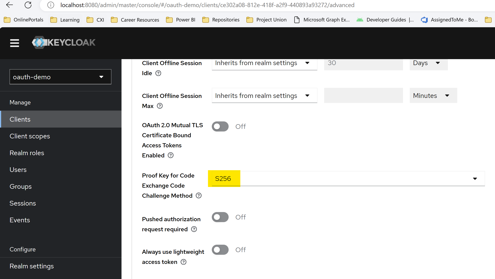

## PKCE hands-on

Prerequisite
1. [Setup keycloak server](/keycloak-setup/README.md) 
2. [Setup a new realm ](/keycloak-setup/README.md#create-a-realm)
3. [Add user](/keycloak-setup/README.md#create-a-user)
4. [Register client app](/standard-authorization-flow/client-registration.md)

In Client page select Advanced Tab and make sure Proof Key for Code Exchange Code Challenge Method is selected as S256. 

If the client is registered as confidential client then <code>client_secret</code> would be needed while exchanging authorization code with token at token endpoint of Authorization server. This will provide an additional layer of security to confidential clients. 

Public clients do not possess the <code>client_secret</code> and only client_secret is not needed for code-token exchange. 





### Code Verifier and Code Challenge Generation

```java
import java.nio.charset.StandardCharsets;
import java.security.MessageDigest;
import java.security.NoSuchAlgorithmException;
import java.security.SecureRandom;
import java.util.Base64;

public class PKCEUtil {

    public static void main(String[] args) throws NoSuchAlgorithmException {
        String codeVerifier = codeVerifier();
        System.out.println("Code Verifier: " + codeVerifier);
        System.out.println("Code Challenge: " + codeChallenge(codeVerifier));
    }

    public static String codeVerifier() {
        SecureRandom random = new SecureRandom();
        byte[] codeVerifier = new byte[32];
        random.nextBytes(codeVerifier);
        return Base64.getUrlEncoder()
                .withoutPadding()
                .encodeToString(codeVerifier);
    }

    public static String codeChallenge(String codeVerifier) throws NoSuchAlgorithmException {
        byte[] bytes = codeVerifier.getBytes(StandardCharsets.US_ASCII);
        MessageDigest messageDigest = MessageDigest.getInstance("SHA-256");
        messageDigest.update(bytes, 0, bytes.length);
        byte[] digest = messageDigest.digest();
        return Base64.getUrlEncoder().withoutPadding().encodeToString(digest);
    }
}
```

<hr />

Sample Run:
```
Code Verifier: tlii_ea3G-Evef5MxK2F5I-W8d6zHPnaR3KfTYxeibY
Code Challenge: Rew35_Mz2-DPl8GGHU9Q4gzP_cjv41_O8XFpc18Y0lI
```

```
Well known enpoint: http://localhost:8080/realms/oauth-demo/.well-known/openid-configuration 
Authorization Endpoint: http://localhost:8080/realms/oauth-demo/protocol/openid-connect/auth 
Token Endpoint: http://localhost:8080/realms/oauth-demo/protocol/openid-connect/token
```
<hr />

Client sends a redirect response to resource owner which triggers an HTTP GET to Authorization server to initiate the authorization flow. In this step user login to the Authorization server and provides the consent 
> http://localhost:8080/realms/oauth-demo/protocol/openid-connect/auth?response_type=code&client_id=photo-app-code-flow-client&scope=openid&redirect_uri=http://localhost:8081/callback&code_challenge=ZxtSVWp0VQUbIsuBLZ_39aaMVPBuDuCIbCUG2x2KBpI&code_challenge_method=S256&state=HYRT75JDK


Redirect Response By Authorization Server will result in this HTTP GET
>http://localhost:8081/callback?state=HYRT75JDK&session_state=c8bfd47a-0a48-468b-8c47-341d00268662&iss=http%3A%2F%2Flocalhost%3A8080%2Frealms%2Foauth-demo&code=582883f1-5cac-4c38-8922-97a550c6d519.c8bfd47a-0a48-468b-8c47-341d00268662.ce302a08-812e-418f-a2f9-440893a93272


HTTP Post by client to Token Endpoint


