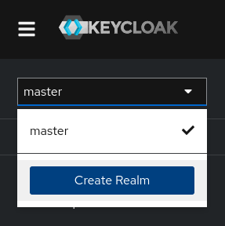
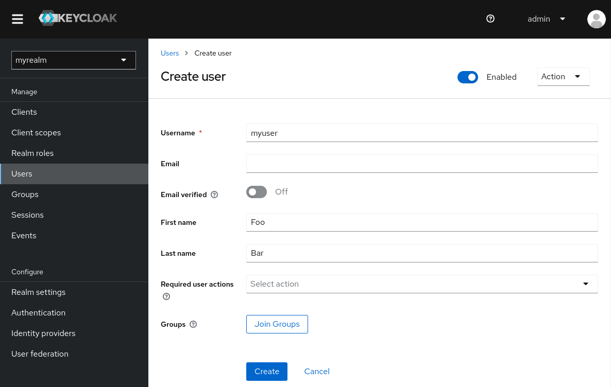
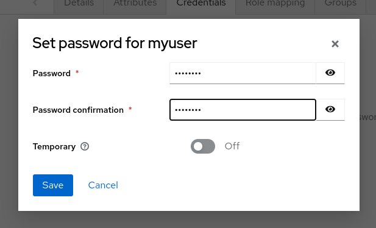

# Get started with Keycloak on bare metal

## Before you start
Make sure you have Java 17 or higher version installed.

## Download Keycloak
Download and extract keycloak-24.0.1.zip from the Keycloak website.
After extracting this file, you should have a directory that is named <code >keycloak-24.0.1.</code>

## Start Keycloak
From a terminal, open the <code>keycloak-24.0.1 directory.</code>

Enter the following command:

- On Linux, run:
    <pre>bin/kc.sh start-dev</pre>
- On Windows, run:
    <pre>bin\kc.bat start-dev</pre>

Using the <code>start-dev</code> option, you are starting Keycloak in development mode. In this mode, you can try out Keycloak for the first time to get it up and running quickly. This mode offers convenient defaults for developers, such as for developing a new Keycloak theme.

## Create an admin user
Keycloak has no default admin user. You need to create an admin user before you can start Keycloak.

1. Open http://localhost:8080/.
2. Fill in the form with your preferred username and password.

## Log in to the Admin Console
1. Go to the [Keycloak Admin Console](http://localhost:8080/admin/master/console/) (http://localhost:8080/admin/master/console/)
2. Log in with the admin username and password you created earlier.

## Create a realm
A realm in Keycloak is equivalent to a tenant. Each realm allows an administrator to create isolated groups of applications and users. Initially, Keycloak includes a single realm, called master. Use this realm only for managing Keycloak and not for managing any applications.

Use these steps to create the first realm.

1. Open the [Keycloak Admin Console](http://localhost:8080/admin/master/console/) (http://localhost:8080/admin/master/console/)
2. Click the word <b>Keycloak</b> in the top-left corner, then click <b>Create Realm</b>.
3. Enter <code>myrealm</code> in the <b>Realm name</b> field.
4. Click <b>Create</b>.

## Create a user
Initially, the realm has no users. Use these steps to create a user:

1. Open the [Keycloak Admin Console](http://localhost:8080/admin/master/console/) (http://localhost:8080/admin/master/console/)
2. Click the word <b>Keycloak</b> in the top-left corner, then click myrealm.
3. Click <b>Users </b> in the left-hand menu.
4. Click <b>Add user</b>.
5. Fill in the form with the following values:
    - <b>Username:</b> <code> myuser </code>
    - <b>First name:</b> any first name
    - <b>Last name:</b> any last name

6. Click <b>Create</b>.

This user needs a password to log in. To set the initial password:
1. Click Credentials at the top of the page.
2. Fill in the Set password form with a password.
3. Toggle Temporary to Off so that the user does not need to update this password at the first login.

## Log in to the Account Console
You can now log in to the Account Console to verify this user is configured correctly.

1. Open the [Keycloak Account Console](http://localhost:8080/realms/myrealm/account) (http://localhost:8080/realms/{realm-name}/account). We have created a realm with name <b>myrealm</b> so the url in this case would be http://localhost:8080/realms/myrealm/account

2. Log in with myuser and the password you created earlier.

As a user in the Account Console, you can manage your account including modifying your profile, adding two-factor authentication, and including identity provider accounts.

## Secure the first application
To secure the first application, you start by registering the application with your Keycloak instance:

1. Open the [Keycloak Admin Console](http://localhost:8080/admin/master/console/) (http://localhost:8080/admin/master/console/)
2. Click the word <b>Keycloak</b> in the top-left corner, then click <b>myrealm</b>.
3. Click <b>Clients</b>.
4. Click <b>Create client</b>
5. Fill in the form with the following values:
    - <b>Client type</b>: <code>OpenID Connect</code>
    - <b>Client ID</b>: <code>myclient</code>
    

6. Click <b>Next</b>
7. Confirm that <b>Standard flow</b> is enabled.
8. Click <b>Next</b>.
9. Make these changes under <b>Login settings</b>.
    - Set Valid redirect URIs  (for example, use https://www.keycloak.org/app/* for demo app)
    - Set Web origins to https://www.keycloak.org or leave blank
10. Click <b>Save</b>.

To confirm the client was created successfully, you can use the SPA testing application on the Keycloak website.
1. Open https://www.keycloak.org/app/.
2. Click Save to use the default configuration.
3. Click Sign in to authenticate to this application using the Keycloak server you started earlier.
4. login with the user created in the myrealm

### References:
1. Keycloak Getting started guide https://www.keycloak.org/getting-started/getting-started-zip