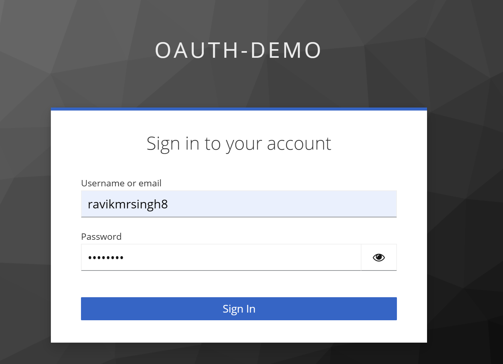

## Authorization Code Grant
This is a redirection based flow. 

The authorization code grant uses <b>a temporary credential (short lived, can be used only once) the authorization code</b>, to represent the resource owner’s delegation to the client, the entire flow to get authorization code and exchanging it with Authorization server to get access token looks like what is shown in figure 2.1. 

Figure 2.1 The Authorization code grant in detail

### Authorization code grant in detail
lets break this down into individual steps. First the resource owner goes to the client application and indicates to the client that they would like it to use a particular resource on their behalf. For instance, this is where the user would tell the printing service to use a specific photo storage service. This service is an API that the client knows how to process, and the client knows that it needs to use OAuth to do so.

When the client realizes that it needs to get a new OAuth access token, it sends the resource owner to the authorization server with a request that indicates that the client is asking to be delegated some piece of authority by that resource owner

Figure 2.2

The redirect to the browser sends and HTTP GET to the authorization server which looks like this

> http://localhost:8080/realms/oauth-demo/protocol/openid-connect/auth?response_type=code&client_id=photo-app-code-flow-client&scope=openid&redirect_uri=http://localhost:8081/callback&state=HjKDMN

Next, the authorization server will usually require the user to authenticate. This step is essential in determining who the resource owner is and what rights they’re allowed to delegate to the client.

The user’s authentication passes directly between the user (and their browser) and the authorization server; it’s never seen by the client application. This essential aspect protects the user from having to share their credentials with the client application

Figure 2.3

  

Next, the user authorizes the client application (figure 2.4). In this step, the resource owner chooses to delegate some portion of their authority to the client application. 

The client’s request can include an indication of what kind of access it’s looking for (known as the OAuth scope). The authorization server can allow the user to deny some or all of these scopes, or it can let the user approve or deny the request as a whole.

Figure 2.4

Next, the authorization server redirects the user back to the client application

Figure 2.5

This in turn causes the browser to issue the following GET request back to the client. Since we’re using the authorization code grant type, this redirect includes the special code query parameter. The value of this parameter is a one-time-use credential known as the authorization code, and it represents the result of the user’s authorization decision.

> http://localhost:8081/callback?state=HjKDMN&session_state=aefa4dfe-50ba-4249-9d7d-c1fcdba46fd1&iss=http%3A%2F%2Flocalhost%3A8080%2Frealms%2Foauth-demo&code=f6412402-5736-47f1-9db8-b10ca5033b10.aefa4dfe-50ba-4249-9d7d-c1fcdba46fd1.ce302a08-812e-418f-a2f9-440893a93272 

The client can parse this parameter to get the authorization code value when the request comes in, and it will use that code in the next step. The client will also check that the value of the state parameter matches the value that it sent in the previous step.

Figure 2.6

Now that the client has the code, it can send it back to the authorization server on its token endpoint. 
The client performs an HTTP POST with its parameters as a form-encoded HTTP entity body, passing its client_id and client_secret as an HTTP Basic authorization header. This HTTP request is made directly between the client and the authorization server, without involving the browser or resource owner at all.

Post request to Token endpoint

