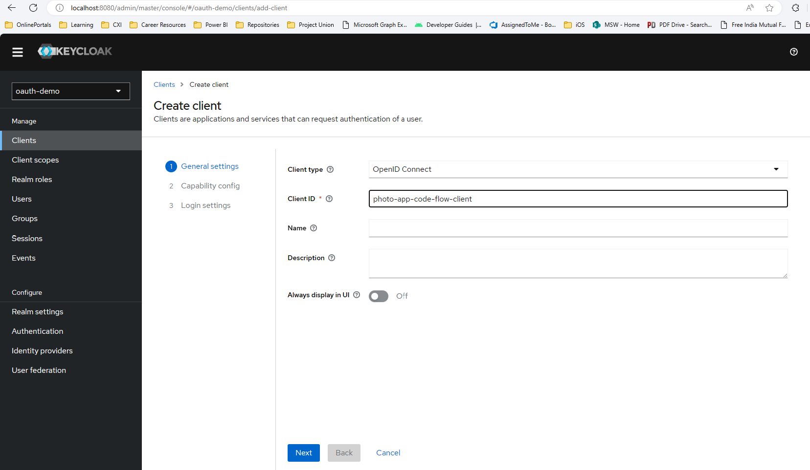
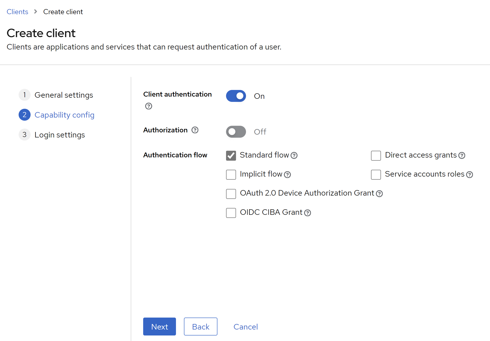
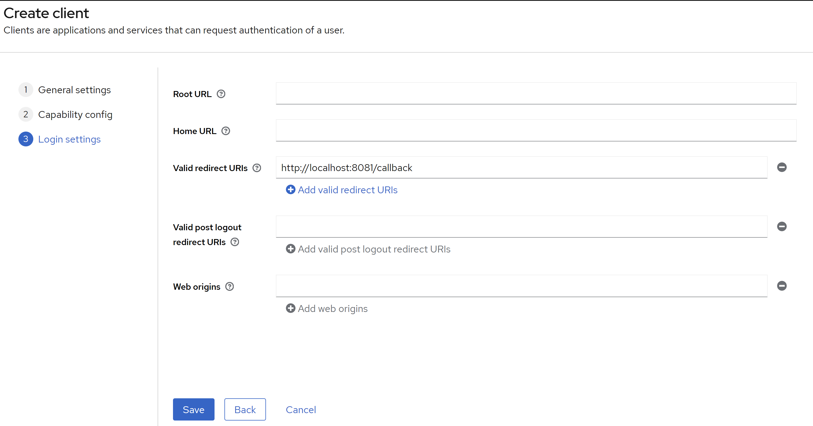

# Client registrartion to the Authorization Server
Prerequisite
1. [Setup keycloak server](/keycloak-setup/README.md) 
2. [Setup a new realm ](/keycloak-setup/README.md#create-a-realm)
3. [Add user](/keycloak-setup/README.md#create-a-user)
3. [Register a new Client](/keycloak-setup/README.md#secure-the-first-application)

### Client used in example code

